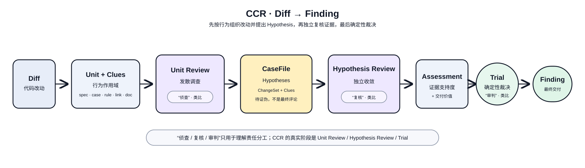

# case-code-review (`ccr`)

> AI 代码评审 CLI——在 [open-code-review](https://github.com/alibaba/open-code-review) 的基础上继续深化。｜ English: [README.md](./README.md)

## 理念

只看 diff 不足以做好评审：diff 说不出这次改动有没有破坏它服务的需求、有没有影响依赖它的代码。ccr 围绕三个想法构建：

**1. 捕获相关 Knowledge。** Language Knowledge 提供 definition、reference、call 和源码文档；Project Knowledge 识别 Repository 中的 Component，以及 source、entrypoint、handler、manifest、lock 等文件角色；作者提供的 spec、case、rule 和 link 再补充显式契约。

**2. 按 *Unit* 而不是按文件评审。** Unit 是一次行为评审的作用域，可以是函数、文件或跨文件 call-chain。当整个 diff 只有一个需评审文件时，收为一个 File Unit；多个文件中彼此调用的改动函数合为一个 call-chain Unit，因为分成两个 file loop 最终也要重复读取彼此。目标是 Review 1 loop 数不多于需评审文件数，跨文件协作时进一步减少。

**3. 把发现与裁决分开。** 每个 Unit Review 可以产出零到多个可证伪的 Hypothesis，不直接发布评论；当前一次 run 的全部 Hypothesis 统一进入一个 change-set CaseFile，Hypothesis Review 用只读证据复核并产出 Assessment；确定性的 Trial 只交付证据支持、由本次变更造成、值得行动且不重复的 Finding。

ccr 不追求通读仓库或穷举所有问题，而是在相关、有界的上下文中，优先发现实现需求时容易忽略的具体缺陷，例如边界处理、错误路径、API 误用或 caller 假设被破坏。隐含业务约束需要需求背景、spec、case 或 rule 等显式知识；加载更多无关代码不能凭空补足这些知识。语法问题仍归 lint 管。

评审质量盯三个互相拉扯的追求——**健壮性、准确性、成本**;落地手段以 review loop 为核心,分能力 / 粒度 / context 三个抓手。展开见 `AGENTS.md`。



设计展开：[`Kernel`](docs/kernel.md) · [`Unit`](docs/unit-model.md) · [`Unit Review`](docs/unit_review.md) · [`Hypothesis Review`](docs/hypothesis_review.md) · [`Harness 与可观测性`](docs/harness.md)

## Knowledge 与上下文

Project Knowledge 先决定一个改动文件如何参与评审：

| 文件角色 | 评审行为 |
|---|---|
| **source** | 可以成为 Unit target |
| **entrypoint / handler** | 仍是 source，并补充项目语义下的评审重点 |
| **manifest / lock** | 随源码改动作为项目上下文；单独变化不启动 Unit Review |
| **version** | 仅作为发布元数据观测；单独变化不启动 Unit Review |

ccr 为每个 review unit 汇集一组线索(clue)。一条线索 = 一种**证据种类**,经某种**关系**到达——两条正交轴(详见 [`docs/unit-model.md`](docs/unit-model.md)):

| 种类 | 是什么 | 来源 |
|---|---|---|
| **spec** | 符号的契约(必须保证什么) | authored(`spec.json`) |
| **case** | 要核对的具体场景 | authored |
| **rule** | 审查准则——盯什么 | authored |
| **link** | 作者策展的 "see also"——文档或另一个函数 | authored |
| **doc** | 符号的 docstring / doc 注释 | **运行时从源码抽取** |
| **history** | 之前 revision 已交付的 finding | Forge 输入 |
| **project** | Component、FileRole 或项目结构知识 | 从 Repository 派生 |

| 关系 | 到达的符号 |
|---|---|
| **self** | 被改动的符号本身 |
| **owner** | 所属类/类型(改方法时看到类的契约) |
| **caller** | 谁在用它——上溯到最近带 authored spec 的祖先(治理契约) |
| **callee** | 它依赖什么——直接被调方的契约 |
| **used** | diff 里引用到的类型/函数(经 import 解析,同名符号可消歧) |
| **project** | 为 Unit 提供背景的 Component 或项目事实 |

两个值得知道的性质:

- **`doc` 零采纳成本。** authored 四类需要 [`spec-case`](https://github.com/qiankunli/spec-case) 标注;`doc` 在评审时直接从源码抽取(Python docstring、Go doc 注释)——**包括依赖的源码**。一个从没听说过 spec-case 的仓，在源码关系上照样有契约上下文。
- **跨仓靠 fqn。** 仓内符号用 `relpath::symbol` 寻址;依赖把自己的 `spec.json` 随包发(Go module cache / Python site-packages),其条目**只按 fqn**(`import路径.符号`)匹配、经你的 import 解析——所以 diff 用到某框架类型时,框架标的"仅 per-request"规则会命中。

## 使用

### 安装

```bash
git clone https://github.com/compforge/case-code-review && cd case-code-review
make install        # 构建并安装 `ccr` 到 ~/.local/bin(macOS 自动重签名)
# 或:go install github.com/qiankunli/case-code-review/cmd/ccr@latest
```

### 配置 LLM

配置存于 `~/.casecodereview/config.json`。交互式:

```bash
ccr config provider     # 选内置 provider 或添加自定义(url / protocol / api_key)
ccr config model        # 为当前 provider 选模型
ccr llm test            # 验证连通性
```

非交互(CI / 脚本):

```bash
ccr config set provider anthropic
ccr config set providers.anthropic.api_key $ANTHROPIC_API_KEY
ccr config set providers.anthropic.model claude-sonnet-4-6
```

自定义 provider(私有网关、OpenAI 协议端点)支持 `url`、`protocol`、`extra_body`、`extra_headers`、`timeout_sec` 和 `models` 列表——见 `ccr config --help`。

### 评审

```bash
ccr review                              # 工作区:staged + unstaged + untracked
ccr review --from main --to my-branch  # 分支 vs 基线(merge-base 模式)
ccr review --commit abc123              # 单个 commit vs 其父
ccr review --format json                # 机器可读输出(CI、bot)
ccr review --background "$(cat mr.md)"  # 注入需求/业务背景以提准
ccr review --history prior.json         # 上轮 findings,对新 diff 复核
```

连续评审 PR/MR 时,Forge comments 才是持久 history。每个 revision 由调用方临时拉取当前
PR/MR comments,生成一次性的 `prior.json` 并传给 ccr；devloop 与 review-harness 会自动完成。
key 优先用 symbol-id；Forge 只保留文件锚点时可退化为仓库相对 path,例如
`{"path/to/file.go::Symbol":[{"msg":"prior finding","sha":"abc123"}]}`。

### 花 token 之前先看装配

两者都不调 LLM:

```bash
ccr review --preview            # 哪些文件会被评审 / 被排除
ccr review --dry-run            # + 每个 unit 装配好的完整上下文(LLM 将看到什么)
ccr review --dry-run --format json   # + 结构指标:unit/scope 计数与 clue_coverage
                                     #   矩阵(关系/种类,如 owner/rule、callee/doc)
```

`--dry-run --format json` 是免费的 A/B 层:对比两次运行的指标,不花一次 LLM 调用就能看清某个特性或某份 spec.json 带来了什么。

### Feature gates(消融)

每项能力都有具名开关,默认**全开**。关掉一个,测它的边际效果(leave-one-out):

```bash
ccr review --feature doc=off             # 关 derived docstring 线索
ccr review --feature caller_callee=off   # 关 call-graph 邻域
ccr review --feature callchain=off       # 关跨文件调用链 unit
```

kind 门(`spec_case` / `rule` / `link` / `doc`)把一种证据在**所有关系**上一起开关;`caller_callee` 是 call-graph 遍历的成本门。也可经 config 的 `features:{}` 或 `CCR_FEATURES` 环境变量设置。完整列表见 `ccr review --help`。

### authored 契约(可选,推荐)

用 [`spec-case`](https://github.com/qiankunli/spec-case) 标注函数/类(Go doc 注释 marker / Python 装饰器),用其 `specgen` 产出 `spec.json`,放到 `.casecodereview/spec.json`——ccr 自动加载(另有 `~/.casecodereview/spec.json` 与 `--spec path`,高优先层胜)。依赖包内随包发的 `spec.json` 自动发现、按 fqn 匹配。

### 其它

```bash
ccr scan                        # 全文件评审,不需要 diff(--path 缩小范围)
ccr rules                       # 查看哪些评审规则作用于哪些路径
ccr viewer                      # WebUI：Diff→Review 1 漏斗、run 总览、prompt 时间线与决策轨迹
```

## 状态

活跃开发中。已有：Project / Language Knowledge、项目感知 FileRole、Unit formation（函数 / 文件 / call-chain）、两阶段证据 Review、feature gates、dry-run 指标、跨 revision history 复核与可观测 Session Viewer。

## License

Apache-2.0(见 `LICENSE` / `NOTICE`)。
