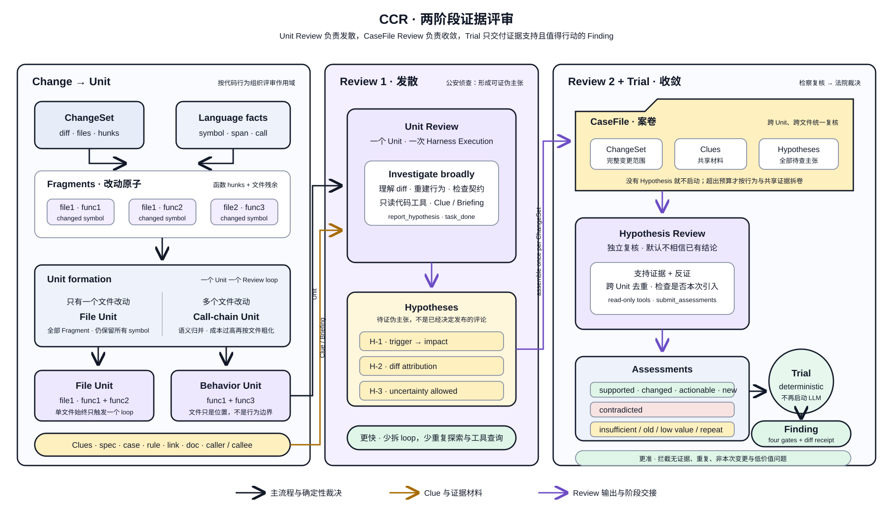

# CCR Kernel：Language × Unit × Harness

> 绿地架构总览。本文只定义长期稳定的能力中心、依赖方向与扩展纪律；领域模型、流程细节和
> 当前实现分别由 References 中的专题文档与代码负责。

## 理念 / 概念

CCR 的主线是：**在时间与 token 预算可控的前提下，为每个 Unit 提供足够的上下文，提高
review 质量并减少误报。**

沿这条主线，内核收敛成三个能力中心：

| 能力中心 | 拥有什么 | 不拥有什么 |
|----------|----------|------------|
| **Language** | 从源码得到 symbol、span、call、reference、doc 等语言事实 | Unit、评审策略、prompt 和执行状态 |
| **Unit** | 评审作用域，以及围绕作用域汇总的 Clue、Dossier、Briefing | LLM 调用、工具执行、压缩和运行预算 |
| **Harness** | Agent 执行、工具调度、上下文生命周期、压缩、预算、事件与终态 | 源码语义、Unit 形成规则和 finding 业务判断 |

三个中心之外保留一个薄的 **Runner** 编排入口：它拥有输入模式与评审结果。git diff 和
full-file scan 都先归一为 Unit 的 `Change` 输入；最终 `Hypothesis` / `Assessment` /
`Finding`、行号定位、重定位、Review 与 Trial 都属于 Runner 结果管道。Runner 将每个 Unit
交给 Harness 执行，但不把这些 review 语义下沉到 Harness Core。

这里的“通用 Harness”是指**不含 review 领域分支的执行内核**，不等于建设多 Backend 或
多 Agent 平台。首版在 Go 内收敛 Execution Core，参考 Pi AgentCore 的消息转换、工具 Hook
和事件边界，但不引入 Node 运行时，也不为未来可能接入 Codex、Claude 预建适配层。

Review 结果管道使用一条显式的认知链：

```text
Clue == Harness ==> Hypothesis == Review ==> Assessment == Trial ==> Finding
```

- **Clue** 是围绕 Unit 收集的原始材料，尚未证明某个问题成立，也可能无关或产生误导。
- **Hypothesis** 是发散性的 Unit Review 提出的可证伪问题主张，不是已经决定发布的评论。
- **CaseFile** 是发散阶段移交给收敛式 Review 的案卷：一组可能互相支持、反驳或重复的
  Hypothesis，以及它们共享的 Change 和 Clue。首版一个 ChangeSet 形成一个 CaseFile。
- **Review** 对本次变更的全部 Hypothesis 做独立、收敛式复核；证据不足时通过只读工具检查
  diff、baseline 与相关源码，产出 Assessment。
- **Assessment** 分开记录证据支持度、变更归因、交付价值与交付新颖性；这些判断正交，不能把
  “真实但低价值”“本次变更前已存在”或“已经交付过”混同为“主张错误”。
- **Trial** 根据 Hypothesis、Assessment 与 Runner 签发的证据回执作最终认定；它是 Runner
  持有的确定性规则，不再启动一轮 LLM 调查。
- **Finding** 是通过证据与价值门槛、可以最终交付的问题。

Clue 只有经过核查并与某个 Hypothesis 建立支持或反驳关系后，才成为该 Assessment 的 Evidence。
这些对象及其晋级规则由 Runner 拥有；Harness 只负责执行 Unit Review 或 Hypothesis Review
所需的 Execution。链路中的 `Harness` 表示前一阶段由 Harness Execution 承载，不表示 Harness
拥有 Clue 或 Hypothesis。

这条链可以借公检法分工帮助理解：

- **公安机关侦查**：从现场 Clue 发散出待查的 Hypothesis，并组装 CaseFile，对应 Unit Review；
- **检察院审查起诉**：复核事实、证据和是否值得起诉，必要时补充调查，对应 Review 与
  Assessment；
- **法院审判**：作最终认定，对应 Trial；通过 Trial 的主张才成为 Finding。

类比只用来区分“形成怀疑、独立复核、最终认定”三段责任，不把公安、检察院或法院建成代码类型。



### 更快与更准来自两次不同方向的聚合

两次 Review 面对的对象和优化目标不同：

```text
Clue / Unit == Unit Review ==> Hypothesis
Hypothesis / CaseFile == Hypothesis Review ==> Assessment == Trial ==> Finding
```

**Unit Review 按代码行为聚合，负责发散。** 固定按文件评审时，文件边界既可能把同一调用链
切开，也可能让一次 loop 重复探索已经能够直接提供的上下文。CCR 先识别改动 symbol，再形成
真正触发 loop 的 Unit：

- 只有一个文件改动时，全部 Fragment 收为一个 File Unit，不因文件内改了多个函数而增加 loop；
  同时保留所有 symbol，以 Clue 补充 spec、case、rule、link、doc 与调用关系。相对 file review，
  loop 数不增加，但上下文更完整、更相关。
- 多个文件改动时，文件不再是硬边界；同一调用链或行为上的改动可以组成跨文件 Unit，避免多个
  loop 分别重建同一执行路径。这样既提高一次推理的行为完整性，也有机会减少重复 loop 和工具
  查询；成本超出承载能力时再向文件等更粗粒度收敛。

这里追求的不是机械增加 context，而是提高**相关上下文密度**：能直接定界的 Clue 随 Unit
进入 Briefing，开放式补证才交给只读工具，从而减少 agent 用轮次重新发现 CCR 已知事实。

**Hypothesis Review 按判断关系聚合，负责收敛。** Unit Review 可以主动发散，但它产出的只是
待证伪主张。Runner 把本次变更的 Hypothesis 与共享材料组装成 CaseFile，用一次独立 Review
跨 Unit、跨文件核验证据，识别重复或相互矛盾的主张；没有 Hypothesis 时无需启动。它增加的是
一次有界的 run 级收敛成本，而不是按文件或逐 Hypothesis 再开一批 loop，换来对无证据、
非本次变更、低价值和重复问题的集中拦截。

因此，“更快”来自更少的无谓拆分、重复探索和补证调用；“更准”来自行为完整的 Unit、相关
Clue，以及独立的 CaseFile 复核与确定性 Trial。两者是需要通过 eval 验证的设计假设：
分别观察 Unit/CaseFile 数、token、工具调用和耗时，以及 important/minor/wrong 的保留与拦截、
repeat 的重复交付率，
不能只用 loop 数或 context 长度代替最终效果。

## 流程

```text
Runner Source
  ├── git change（workspace / range / commit）
  └── full-file scan
    │
    ▼
Change + Language Facts
    │
    ▼
Fragment ──merge──▶ Unit
                       │
                       ├── relation / spec / case / rule / link / history
                       ▼
                Dossier + Briefing
                       │
                       ▼
                    Runner
                       │
                       ▼
              Runner Review Extension
                 ├── read-only tools
                 ├── review compaction
                 ├── completion guard
                 └── finding hooks
                       │
                       ▼
                  Harness Core
                 ├── Agent Loop
                 ├── tool runtime
                 ├── context lifecycle
                 ├── token / time budget
                 └── execution outcome
                       │
                       ▼
                 UnitResult / Hypothesis[]
                       │
                       ▼
                    CaseFile
                       │
                       ▼
                Hypothesis Review
                       │
                       ▼
                  Assessment[]
                       │
                       ▼
                    Finding[]
```

这一流程使用两种不同的货币：

- **Unit** 是 review 领域的货币：决定评审什么、携带什么知识，也是 Runner 调度和覆盖率
  统计的基本单位。
- **Execution** 是 Harness 的货币：一次有明确输入、限制和终态的 Agent 执行。Harness 不需要
  知道它执行的是代码评审。

Runner 负责把 Unit 转成 Execution 输入，并把 Execution 结果还原成 UnitResult；跨边界的
转换不进入 Language、Unit 或 Harness Core。

代码所有权与数据流一致：`internal/runner/source` 和 `internal/runner/scan` 是两类输入，
`internal/unit/change` 是形成 Unit 的统一源材料，`internal/runner/review` 是 Hypothesis /
Assessment / Trial，`internal/runner/finding` 是最终结果。不存在平铺的 `internal/diff`、
`internal/scan`、`internal/finding`，
也不允许 Harness 反向依赖这些领域包。

## 关键设计

### 1. 依赖朝事实与通用机制流动

Language 只产事实，Unit 消费事实形成评审作用域与上下文；Harness Core 只消费执行输入。
Review 扩展同时理解 review 契约和 Harness 扩展点，是两侧的适配层。任何 provider
或 wire 类型都不得反向进入 Language 和 Unit。

### 2. Core 只有一套执行模型

Harness Core 统一拥有 Agent Loop、模型调用、工具调度、context projection、compression、
deadline、usage 和 outcome。一次 Execution 创建一个独立 Agent；conversation、compression
job、tool state 和异步收尾不得跨 Execution 共享。

`agent`、`reviewloop`、`llmloop` 不再各自代表一套生命周期。顶层编排只叫 Runner，领域对象
叫 Unit，Harness 只谈 Execution；Agent 是 Harness 内部实现词。

### 3. Review 强化只组合扩展点

Review 能力通过 Tool、ToolGate、Hook、Middleware、Context Strategy、Stop Guard 等扩展点
包在 Core 外围，包括：

- Unit Review 使用封闭的只读代码工具、`report_hypothesis` 与 `task_done`；
- Hypothesis Review 只使用只读代码工具、`submit_assessments` 与 `task_done`；
- 保留 fact、hypothesis、rejected hypothesis、证据引用和未决问题的 review 专用压缩；
- 预算将尽时的 forced wrap-up，以及“没有 `task_done` 就不是完整结果”的结束纪律；
- File/Board 等可重新获取内容的去重与优先淘汰；
- finding 收集、评论重定位、Board 通信和评测事件。

Core 不出现 `if review`。当现有扩展点表达不了需求时，先提炼领域无关的机制，再由 Review
扩展实现策略；不 fork 第二套 loop。

tool 名称不是 Harness 的封闭枚举：Core 只按 Registry 判断工具是否可用，领域工具通过稳定
名称注入。异步 Tool 后处理使用 Harness 的通用 WorkerPool，但结果存储仍由领域 Hook 拥有。

### 4. 预算机制属于 Harness，预算策略属于 Runner

Harness 提供通用的 token lease、usage 结算、deadline 和 turn limit，并保证没有 lease 就不
发送模型请求；主循环、压缩和收尾调用使用同一账本。Runner 根据快速/深度模式决定总额度、
Unit admission 和覆盖策略。

provider usage 只能事后获得，因此预算承诺是“限制新请求的派发”，不是假装账单可以精确封顶。
预算或时间耗尽必须形成明确的 partial/incomplete 结果，不能被下游理解为 clean review。

### 5. 更多上下文不等于无限预载

Unit 负责把能一步定界、高信号的材料组织进 Briefing；开放式探索留给 Harness 中的只读工具。
当上下文增长时，Harness 先按可再生性去重和淘汰，再使用 review 专用压缩。上下文选择、压缩
和预算由此形成一条闭环，而不是三个互不知情的补丁。

### 6. Hypothesis 经 Review 与 Trial 后才能成为 Finding

Unit Review 负责发散并提出 Hypothesis，不同时承担最终认定。Runner 等全部 Unit 终态后聚合
本次变更的 Hypothesis，形成一个 CaseFile，并建立一个独立、收敛式的 Hypothesis Review
Execution：它可以读取任意相关 diff、源码和已有 Clue，也可以通过封闭的只读工具定向补证，
但不能提出新 Hypothesis、产生评论或修改仓库。文件只是证据位置，不是 Review 边界；跨文件的
同一问题和重复 Hypothesis 必须放在同一案卷中比较。后续若单个 ChangeSet 超出预算，按行为链和
共享证据拆 CaseFile，不按文件硬切。

Assessment 把四个问题分开表达：证据是否支持、问题是否由本次变更新增或改变、是否值得交付、
是否已在当前案卷或更早 revision 中交付。模型可以描述它看到的 Evidence，但不能自行声明已经
调用工具；只读工具成功执行后由 Runner 签发 Evidence Receipt。Trial 再以确定性规则消费这些
对象：只有 `supported + caused + actionable + new`，且至少有一条匹配评论锚点
文件的 diff receipt，Hypothesis 才成为 Finding。存在反证、证据不足、旧代码问题、低价值问题
或重复问题时，只留下 Assessment 记录，供 session、viewer 和 eval 解释，不对外发布。

### 7. Review 的只读边界是结构约束

Harness Core 可以执行任意被注入的工具，但 Review 扩展只注册 CCR 控制的只读工具，并以
ToolGate 做硬限制。shell、文件写和 git 状态修改不因 Harness 的通用性而进入 review loop；
需要副作用的能力属于评审之后的独立执行环节。

## References

| 主题 | 文档 |
|------|------|
| 源码事实、symbol-id 与解析后端边界 | [Language：源码事实边界](language.md) |
| Fragment、Unit、作用域形成与合并轴 | [Unit 模型](unit-model.md) |
| Clue、Relation、Dossier 与 Briefing | [Context 模型](context-model.md) |
| caller/callee、repo-map 与图消费策略 | [Codegraph：统一图消费层](codegraph.md) |
| review 领域消息、lowering、去重与驱逐 | [Message 模型](message-model.md) |
| Execution、Agent Loop、上下文、预算与终态 | [Harness 模型](harness.md) |
| Runner、UnitExecution、预算与结果终态 | [Runner 模型](run-model.md) |
| Board、Bulletin 与跨 Unit 协作 | [Review Team](cross-unit.md) |
| 质量、成本与健壮性的评测闭环 | [Eval README](../eval/README.md) |
